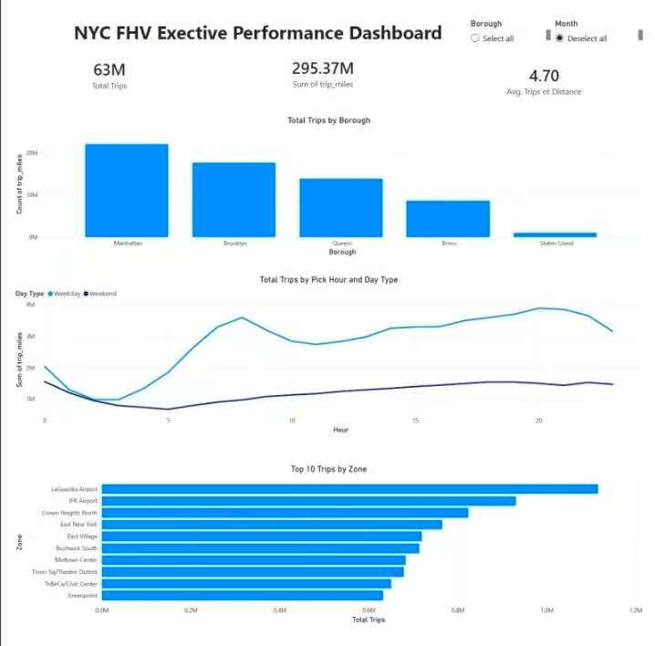
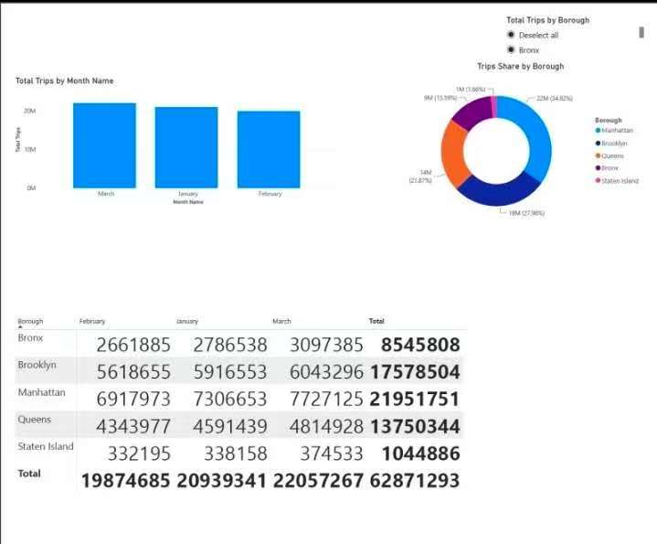
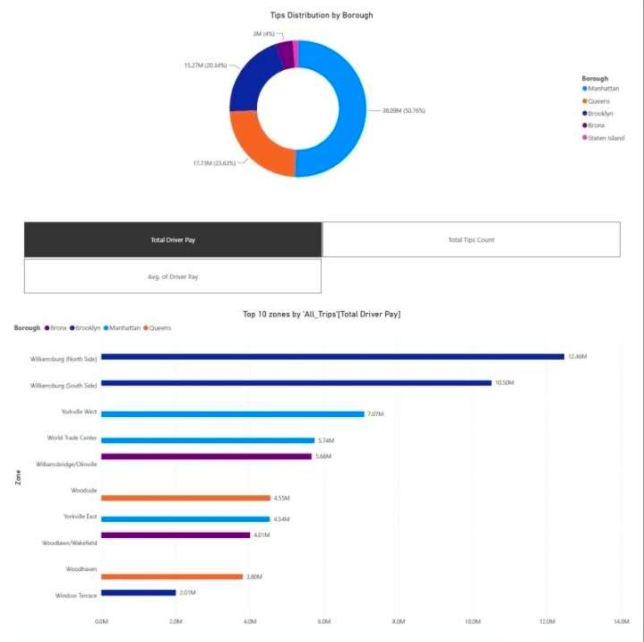

# NYC FHV Power BI Dashboard

A Power BI dashboard built to analyze New York City For-Hire Vehicle (FHV) trip activity from January through March 2026. The dashboard helps users monitor trip demand, operational trends, and key performance metrics through interactive visualizations.

---

# Project Summary

| Item | Details |
|------|---------|
| Industry | Transportation |
| Role | Power BI Developer |
| Dashboard Type | Operational Dashboard |
| Audience | Business Stakeholders |
| Tools | Power BI, Power Query, DAX, Excel |
| Skills | Data Modeling, Data Visualization, KPI Development, Business Analysis |

---

# Dashboard Preview

## Executive Overview

- Provides an executive overview of NYC FHV operations, including total trips, trip distance, trip duration, peak-hour activity, airport demand, and overall operational performance.

---

## Trip Trend Analysis

- Analyzes trip demand over time, comparing monthly trends, weekday versus weekend activity, airport trips, and peak operating periods to identify demand patterns.

---

## Driver & Operational Analysis

- Evaluates operational performance across pickup and drop-off locations, helping stakeholders monitor trip distribution, identify high-demand areas, and support fleet planning and resource allocation.

---

# Business Problem

Business users need an efficient way to monitor trip demand, identify operating trends, and compare performance across different locations and time periods.

Instead of reviewing multiple reports, this dashboard provides a single interactive view of the most important business metrics.

---

# Project Overview

This dashboard analyzes NYC FHV trip data from January through March 2026.

Users can:

- Monitor overall trip volume
- Analyze monthly trends
- Identify peak operating hours
- Compare trip activity by location
- Explore data using interactive filters

---

# Key Features

- Executive KPI dashboard
- Monthly trend analysis
- Peak hour analysis
- Interactive slicers
- Location-based analysis
- Custom DAX measures

---

# Data Preparation

- Combined monthly datasets from January through March 2026
- Cleaned and transformed data using Power Query
- Built relationships between datasets
- Created calculated measures using DAX
- Designed an interactive Power BI data model

---

# Tools Used

- Power BI
- Power Query
- DAX
- Excel

---

# Data Source

Primary Dataset

- NYC TLC For-Hire Vehicle (FHV) Trip Records
- Analysis Period: January–March 2026

Supporting Data

- NYC Taxi Zone Lookup Table
- NYC Taxi Zone Shapefile

---

# Skills Demonstrated

- Data Cleaning
- Data Transformation
- Data Modeling
- DAX Development
- KPI Dashboard Design
- Business Analysis
- Data Visualization

---

# Business Value

This dashboard provides a centralized view of operational performance, making it easier to monitor trip activity, identify trends, and review key performance metrics.

---

# Future Improvements

- Expand the analysis with additional months of data
- Add year-over-year comparisons
- Publish to Power BI Service
- Implement scheduled data refresh
